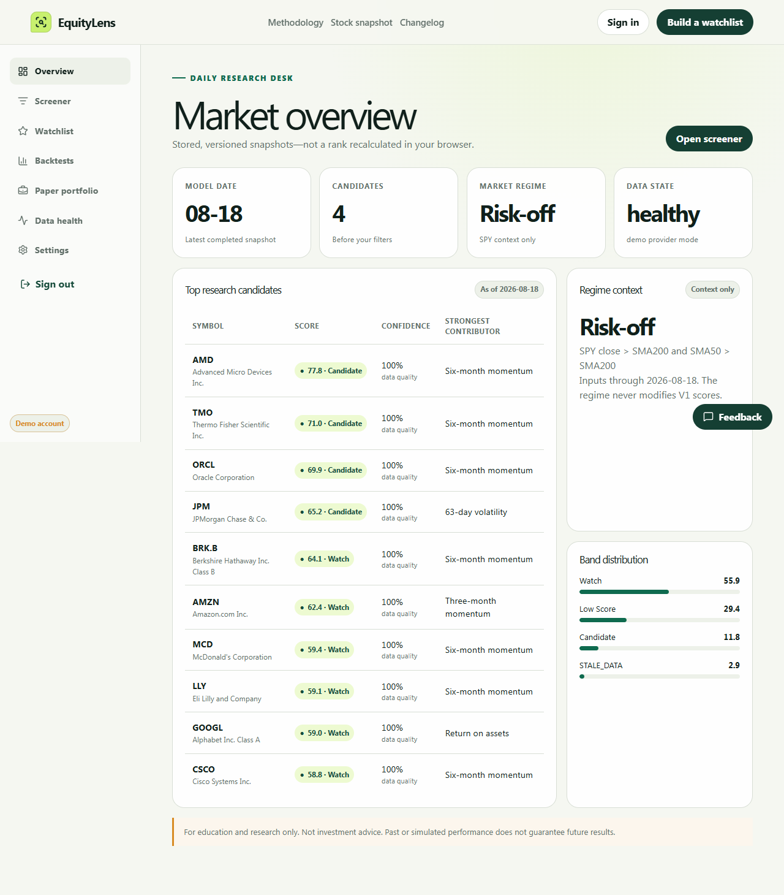

# EquityLens

EquityLens is a full-stack, explainable equity-research application. It ranks a versioned stock universe with deterministic momentum, trend, quality, value, and risk factors; shows the evidence behind each score; runs point-in-time backtests; and tracks a simulated portfolio. It never places real trades.

> For education and research only. Not investment advice. Past or simulated performance does not guarantee future results.



## What is implemented

- Public landing, methodology, legal, changelog, stock snapshots, metadata, Open Graph images, sitemap, and robots routes.
- Argon2id authentication, rotating refresh sessions, CSRF protection, verification/reset email flows, roles, export, and reversible deletion.
- Authenticated dashboard, screener, stock research, watchlist, onboarding, backtests, paper portfolio, settings, data health, and feedback.
- Deterministic `equitylens-v1` scoring with stored snapshots, confidence, data warnings, contributor explanations, and SPY market context.
- Monthly walk-forward backtests with next-session execution, costs/slippage, benchmark and drawdown series, and immutable configuration.
- Vendor-neutral demo, Alpaca, and SEC provider boundaries; 34 candidate stocks plus SPY; deterministic five-year demo data.
- Celery worker/Beat jobs, PostgreSQL/Redis Compose topology, Alembic migrations, admin operations, audit records, analytics, Sentry, and Resend adapters.
- Vercel/Railway configuration, CI, post-deploy smoke tooling, runbook, launch checklist, and market-data licensing gate.

## Quick start

Requirements: Node.js 22+, pnpm 10+, and Python 3.12+.

```powershell
python -m venv .venv
.venv\Scripts\Activate.ps1
python -m pip install -e "apps/api[dev]"
pnpm install
pnpm seed
pnpm dev
```

Open `http://localhost:3000` and choose **One-click demo login**. Local mode uses SQLite, deterministic synthetic market data, captured email files, and eager background jobs; no provider credentials are required.

For the production-shaped local topology, copy `.env.example` to `.env` and run:

```powershell
docker compose up --build
```

## Repository map

| Path | Purpose |
|---|---|
| `apps/web` | Next.js App Router web application |
| `apps/api` | FastAPI API, scoring, backtests, providers, jobs, and migrations |
| `config/universe.csv` | Versioned candidate universe and SPY benchmark |
| `docs` | API, analytics, data-display, architecture, launch, and screenshot evidence |
| `deploy` / `railway.toml` | API, worker, and singleton scheduler deployment definitions |
| `scripts` | Migration release lock and local/post-deploy smoke checks |

Browser requests use same-origin `/api/v1/*`; Next.js proxies them to the server-only API upstream. Production runs the web on Vercel and API/worker/scheduler with managed PostgreSQL and Redis on Railway.

## Verification

```powershell
pnpm format:check
pnpm lint
pnpm typecheck
pnpm test
pnpm build
pnpm test:e2e
```

The completed local evidence is in [COMPLETION_REPORT.md](COMPLETION_REPORT.md). API contracts are summarized in [docs/api.md](docs/api.md), operational setup in [DEPLOYMENT.md](DEPLOYMENT.md), and production gates in [LAUNCH_CHECKLIST.md](LAUNCH_CHECKLIST.md).

## Deployment status

**Live demo: not deployed.** Hosting accounts, DNS, Resend verification, production analytics/monitoring projects, backup restore testing, and market-data redistribution approval require owner authorization. The repository is configured for those steps without claiming they have occurred.
